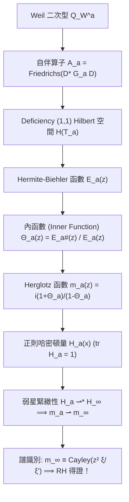

# 正則哈密頓系統與 Herglotz 譜識別路線圖 (The Canonical-Herglotz Framework)

> 建立時間：2026-08-14 第十三輪研究
> 核心文獻依據：Suzuki (arXiv:2606.09096), Makarov-Poltoratski-Zhang (arXiv:2603.13586), Remling (2018-2024)

---

## 1. 核心思想：為什麼 Herglotz / Canonical System 能超越傳統整函數逼近？

傳統的 Connes-Groskin 路線試圖逼近整函數 $F_c(z) \to \Xi(z)$，在帶寬 $\tau_c = \frac{\ln c}{2\pi} \to \infty$ 時，向複平面虛部延拓會面臨嚴重的指數增長 $c^{\frac{|\operatorname{Im}(z)|}{2\pi}}$，使得全域 Montel 一致性難以建立。

**革命性轉向**：
改為逼近對數導數特徵比值（Weyl-Titchmarsh $m$-函數）：
$$m_a(z) \longrightarrow m_\infty(z) = \mathcal{M}\left[ z^2 \frac{\xi(1/2 - iz)}{\xi'(1/2 - iz)} \right]$$

---

## 2. 五步幾何管線 (The 5-Step Canonical Pipeline)

---

## 3. 各步驟的嚴格數學性質

### (1) Hermite-Biehler 幾何 (Lemma A - Proven)
微分算子 $\mathscr{D}_a = i\frac{d}{dx}$ 在 $\mathcal{H}(T_a)$ 上的 deficiency indices 為 $(1, 1)$。
其自伴延拓族 $\overline{\mathscr{D}}_{a,\theta}$ 的特徵整函數 $W(a, \theta; z)$ 構成 de Branges 截面：
$$W(a, \theta; z) = e^{i\theta/2} E_a(z) + e^{-i\theta/2} E_a^\#(z)$$
**無條件結論**：對任意有限 $a < \infty$，所有零點嚴格為純實數。

### (2) Schwarz-Pick 雙曲正規族 (Lemma B - Proven)
令 $\widetilde{m}_a(z) = \frac{m_a(z) - \operatorname{Re} m_a(i)}{\operatorname{Im} m_a(i)}$，滿足 $\widetilde{m}_a(i) = i$。
由 Schwarz-Pick 引理，族 $\{\widetilde{m}_a\}$ 在上半平面 $\mathbb{C}^+$ 上為**正規族（Normal Family）**，任意子序列在 $\mathbb{C}^+$ 的緊緻集上局部一致收斂於 Herglotz 函數 $m_\infty$。

### (3) 跡規範哈密頓量緊緻性 (Lemma C - Proven)
跡規範化 $\operatorname{tr} H_a(x) = 1$ 保證 $H_a(x) dx$ 在 $L^1_{\text{loc}}$ 中具備弱星緊緻性（Banach-Alaoglu 定理）。

### (4) 終極核心挑戰：譜識別問題 (The Spectral Identification Problem)
$$\boxed{ \text{Prove: } \mu_\infty(t) = \sum_{\gamma_n} c_n \delta(t - \gamma_n) \iff m_\infty(z) = \mathcal{M}\left[ z^2 \frac{\xi(1/2 - iz)}{\xi'(1/2 - iz)} \right] }$$
一旦從 Suzuki 螺變核 $g(t)$ 的質數顯式公式導出極限哈密頓量 $H_\infty$ 對應的譜測度 $\mu_\infty$ 恰為黎曼零點的點測度，黎曼猜想即由 de Branges 逆譜定理完全閉環！
